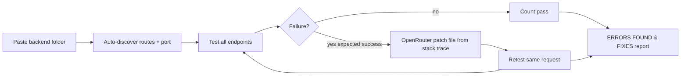
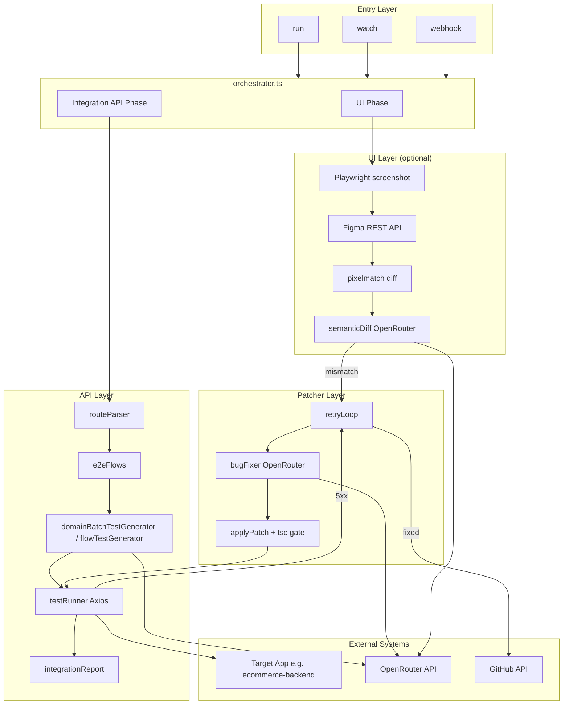
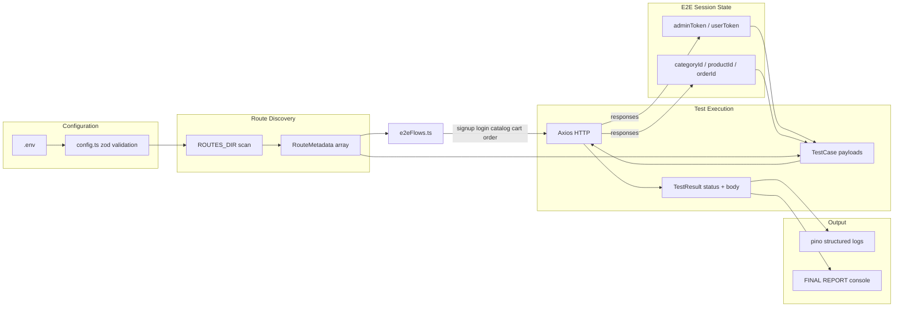
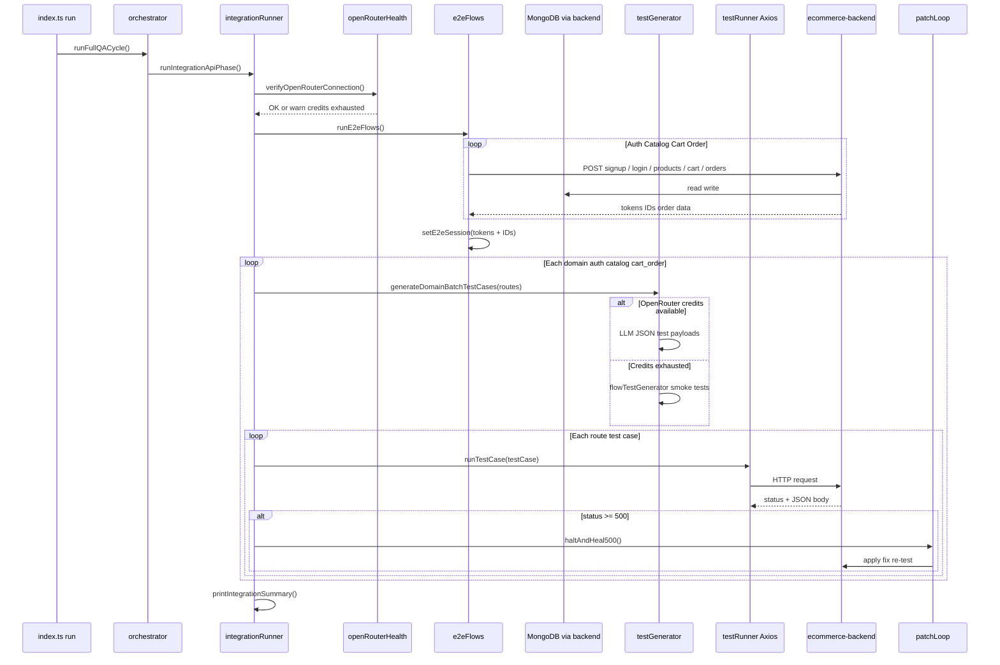
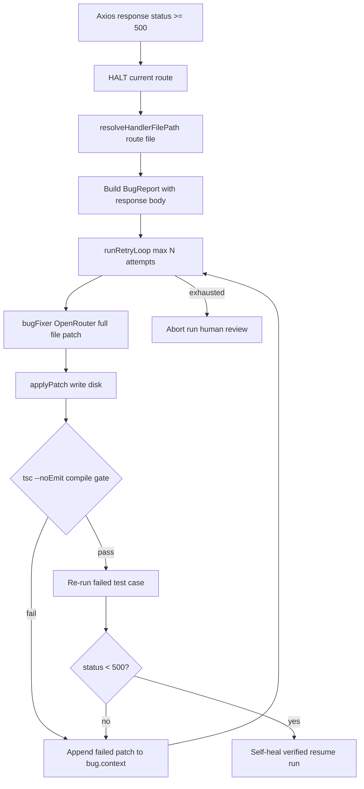
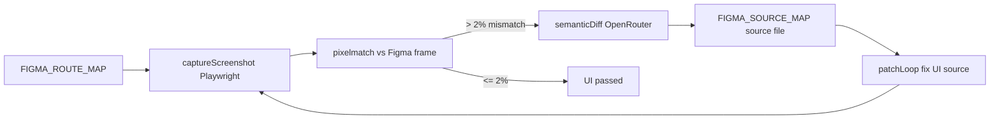

# SQA Agent — Capabilities & Data Flow

> **Last updated:** 2026-06-02  
> **Validated against:** `ecommerce-backend` (27 endpoints, 56 tests passing)

---

## Paste Any Backend & Run

1. Copy your Express API into this directory (e.g. `./my-api/` with `src/routes/*.ts`)
2. Add only OpenRouter keys to `.env`
3. Start your backend server
4. Run:

```bash
tsx src/index.ts discover   # optional — see what was detected
tsx src/index.ts run        # test all routes → fix failures → summary
```

The agent will:

- **Auto-discover** `ROUTES_DIR`, `BASE_APP_URL`, and `GIT_REPO_ROOT`
- **Test every route** (domain-ordered + smoke/flow or LLM-generated cases)
- **Auto-fix** failures when a success response was expected (OpenRouter patch → compile gate → retest)
- **Print a brief summary** of errors found and how each was fixed (or why fix failed)



---

## What It Is

The **Autonomous Full-Stack QA Agent** scans Express route files, executes live HTTP tests against a running app, optionally compares UI to Figma designs, and can **self-heal** backend bugs via an LLM patch loop.

---

## CLI Commands

```bash
tsx src/index.ts run        # Auto-discover, test, fix, summarize
tsx src/index.ts discover   # List detected Express backends
tsx src/index.ts watch      # Re-run on ROUTES_DIR changes (2s debounce)
tsx src/index.ts webhook    # POST /webhook/ci → async QA cycle (202 Accepted)
```

### Required environment

| Variable | Purpose |
|----------|---------|
| `OPENROUTER_API_KEY` | LLM for test generation, patches, vision |
| `OPENROUTER_MODEL` | Model slug (e.g. `anthropic/claude-sonnet-4`) |

### Auto-discovered (optional overrides)

| Variable | Purpose |
|----------|---------|
| `ROUTES_DIR` | Override route scan path |
| `BASE_APP_URL` | Override app URL (default from backend `.env` PORT) |
| `GIT_REPO_ROOT` | Override patch target root |
| `BACKEND_DIR` | Pick one backend when multiple exist |

### Optional environment

| Variable | Purpose |
|----------|---------|
| `AUTO_FIX_ON_FAILURE` | Patch and retest on failures (default `true`) |
| `MAX_PATCH_RETRIES` | Patch loop limit (default 3) |
| `FIGMA_API_TOKEN`, `FIGMA_FILE_KEY` | UI regression |
| `FIGMA_ROUTE_MAP`, `FIGMA_SOURCE_MAP` | Route → Figma node / source file maps |
| `GITHUB_TOKEN`, `GITHUB_REPO_*` | Auto PR on verified fix |

---

## What It Can Do Today

### 1. API integration testing (primary)

| Capability | Detail |
|------------|--------|
| Route discovery | Scans `ROUTES_DIR` for Express `router.get/post/...` definitions |
| Domain-ordered execution | **Auth & Security → Catalog & Products → Cart & Order** |
| E2E scenario flows | Signup, login, admin promotion, create category/product, cart CRUD, checkout, order status |
| Per-endpoint tests | Uses live tokens and IDs from the E2E session |
| Live Axios monitoring | Logs status, response time, and body preview for every request |
| Final report | Console summary: endpoints, pass/fail counts, self-healed files |

**Latest verified run (ecommerce-backend):**

```
Endpoints discovered     : 27
Tests executed           : 56
Tests passed             : 56
Tests failed             : 0
```

### 2. LLM-powered test generation (OpenRouter)

- Verifies OpenRouter connectivity at startup
- Generates 4–6 tests per route per domain (happy path, malformed data, auth, edge cases)
- Falls back to **deterministic flow/smoke tests** when credits are exhausted (402)

### 3. Self-healing on server errors

- Halts on **5xx** responses
- Resolves the target **controller file** from the route definition
- Runs patch loop: OpenRouter fix → TypeScript compile gate → re-test
- Records self-healed files in the final report

**Example fix applied:** `ecommerce-backend/src/services/orderService.ts` — cart populated product IDs during checkout.

### 4. UI regression (built, optional)

- Playwright viewport screenshots (1440×900)
- Figma frame fetch + pixel diff (2% threshold)
- Semantic diff via OpenRouter vision on mismatch
- Patch loop when `FIGMA_SOURCE_MAP` maps routes to source files

Skipped when Figma credentials or route maps are not configured.

### 5. Git / PR integration (optional)

- On verified fix: branch, push, open GitHub PR (if `GITHUB_TOKEN` configured)
- Skipped silently when GitHub env vars are missing

### 6. Triggers

| Trigger | Behavior |
|---------|----------|
| `watch` | chokidar on `ROUTES_DIR`, 2s debounce → full QA cycle |
| `webhook` | `POST /webhook/ci` returns 202, runs cycle async |

---

## High-Level Architecture



---

## Data Flow — Full QA Cycle



---

## Data Flow — API Integration Phase (detail)



---

## Data Flow — Self-Heal on 5xx



---

## Data Flow — UI Phase (when Figma configured)



---

## Project Structure

```
src/
├── index.ts                 # CLI entry
├── orchestrator.ts          # Wires UI + integration phases
├── api/
│   ├── routeParser.ts       # Express route extraction
│   ├── integrationRunner.ts # Domain-ordered API testing
│   ├── e2eFlows.ts          # Full auth → order scenario
│   ├── flowTestGenerator.ts # Per-route tests with session
│   ├── domainBatchTestGenerator.ts  # OpenRouter batch tests
│   ├── testRunner.ts        # Axios execution
│   └── integrationReport.ts # Final console summary
├── ui/                      # Screenshot, Figma, pixel, semantic diff
├── patcher/                 # bugFixer, applyPatch, retryLoop
├── trigger/                 # fileWatcher, webhookServer
├── git/                     # prManager
└── utils/                   # config, types, logger
```

---

## What to Improve Next

### High priority

| Item | Why |
|------|-----|
| OpenRouter credits / cheaper model | Unlock full LLM test matrices (malformed, security, role matrix) |
| Replace admin promotion script | E2E uses `ecommerce-backend/scripts/promoteAdminRole.ts` — prefer seed user or test bootstrap |
| README + `.env.example` sync | Document ports, `GIT_REPO_ROOT`, two-terminal workflow |
| Update memory bank | `progress.md` should reflect completed integration work |

### Medium priority

| Item | Why |
|------|-----|
| Enable UI / Figma phase | Configure `FIGMA_*` and route maps |
| Stronger assertions | Beyond status codes: totals, stock, order state shapes |
| Patch loop for non-5xx | Today only 5xx triggers auto-heal |
| Test isolation | Dedicated test DB or cleanup between runs |

### Lower priority (Phase 2)

- Slack notifications, SQLite run history, multi-env profiles
- Backend health check before run
- Parallel test execution for large APIs

---

## Quick Start (ecommerce-backend)

```powershell
# Terminal 1 — backend
cd ecommerce-backend
npm run dev

# Terminal 2 — QA agent
cd ..
npx tsx src/index.ts run
```

Ensure `.env` includes:

```
ROUTES_DIR=ecommerce-backend/src/routes
BASE_APP_URL=http://localhost:3001
GIT_REPO_ROOT=ecommerce-backend
OPENROUTER_API_KEY=...
OPENROUTER_MODEL=anthropic/claude-sonnet-4
```

---

## Bottom Line

| Area | Status |
|------|--------|
| API E2E + per-endpoint testing | **Working** — validated on ecommerce-backend |
| Domain-ordered integration | **Working** |
| Self-heal on 5xx | **Working** |
| OpenRouter LLM test generation | **Built** — needs credits |
| UI / Figma regression | **Built** — not configured |
| GitHub auto-PR | **Built** — optional |
| Watch / webhook triggers | **Working** |

The agent is a functional **API integration and E2E tester** with optional LLM generation and self-healing. UI regression and rich OpenRouter-driven tests are the main gaps to close next.
